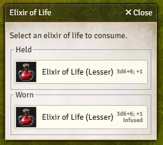
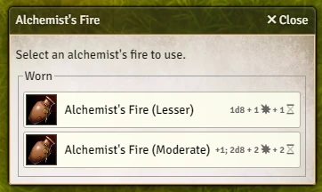

# PF2e Convenient Consumables
Welcome to Convenient Consumables, a module for the Foundry VTT Pathfinder Second Edition system to help you find the consumable you need, now!


[](https://ko-fi.com/jdcalvert)

## Features

### Consumable Selection
There are plenty of consumables which have various types, such as [Elixirs of Life](https://2e.aonprd.com/Equipment.aspx?ID=91) and [Healing Potions](https://2e.aonprd.com/Equipment.aspx?ID=186). When you want a healing potion, you don't want to look through the clutter of your inventory to find which one's best, you just want to know which ones you have, and choose one to take. Enter `game.pf2eConvenientConsumables.postConsumableItem`. You can call this function from a macro, passing in the varients you want to pick from, and it'll show you the best options available in your inventory.

What do we mean by "best"? Generally, you'll want to use the most-accessible consumable available, for example, you probably don't want to retrieve an elixir from your backpack (three actions) if you're wearing one (one action to draw). However, if you have some infused elixirs that will expire at the end of the day, then you may want to use them up first. So, if you have an infused elixir that's "less accessible" than a non-infused elixir, we'll show both.

For example, if you're holding a minor elixir of life in your hand, you have another minor elixir of life (not infused) on your belt, and you have a lesser elixir of life on your belt, we'll display all three, but if all three are on your belt, then we'll only display the infused minor elixir of life and the lesser elixir of life.




#### Using the Function
The function takes the following parameters:

<strong>title: string</strong>
<br>
If you have some consumables to choose from, then this will set the title of the selection dialog.

<strong>header: string</strong>
<br>
If you have some consumables to choose from, then this will set the header text in the selection dialog.

<strong>choices: ...{slug: string, description: string}</strong>
This is a list of the variants you want to choose from. Each choice consists of two fields:
- <strong>slug</strong> (e.g. `"elixir-of-life-minor"`) This is an identifier for the item
- <strong>description</strong> (e.g. `"1d6"`) This is additional information that may be useful for choosing an item, such as how much damage this variant does.

#### Example
The module comes bundled with a few macros for:
- Elixirs of Life
- Healing Potions
- Each of the common alchemical bombs from the Core Rulebook

You can use these macros as a basis for your own macros!

```
game.pf2eConvenientConsumables.postConsumableItem(
    "Elixir of Life",
    "Select an elixir of life to consume.",
    {
        slug: "elixir-of-life-minor",
        description: "1d6; +1"
    },
    {
        slug: "elixir-of-life-lesser",
        description: "3d6+6; +1"
    },
    {
        slug: "elixir-of-life-moderate",
        description: "5d6+12; +2"
    },
    {
        slug: "elixir-of-life-greater",
        description: "7d6+18; +2"
    },
    {
        slug: "elixir-of-life-major",
        description: "8d6+21; +3"
    },
    {
        slug: "elixir-of-life-true",
        description: "10d6+27; +3"
    }
);
```

Here we're passing the slugs and descriptions for the six variants for elixirs of life. Note that the descriptions we pass in tell us how many hit points they heal, and the bonus they give to saving throws against diseases and poisons. This is useful at-a-glance information that you can use to decide which to use.
